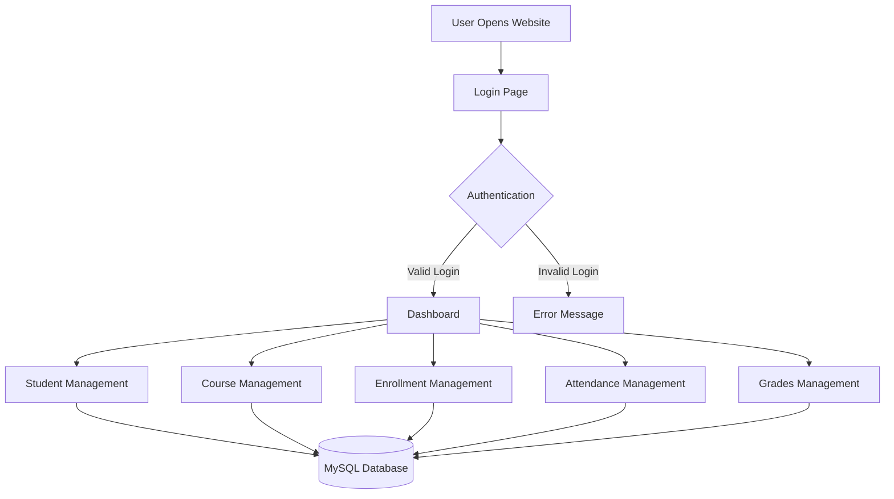
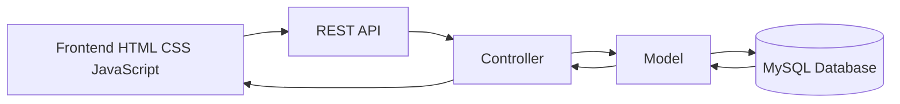
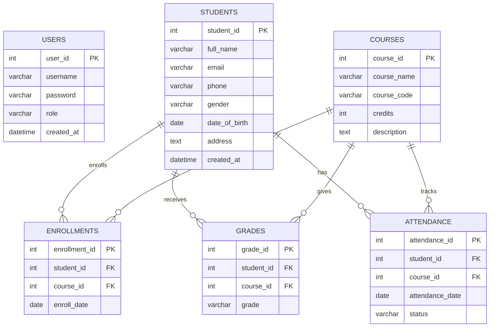
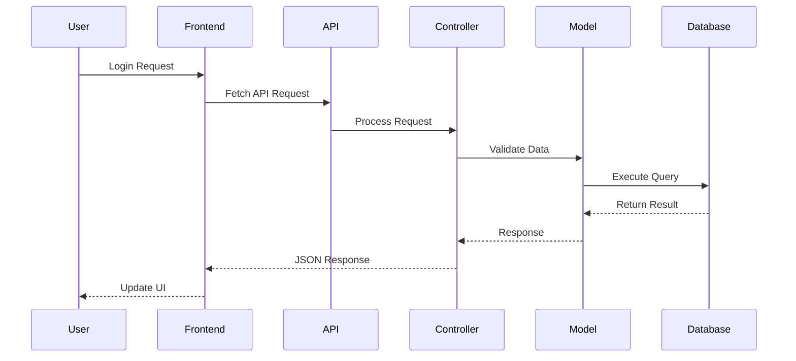
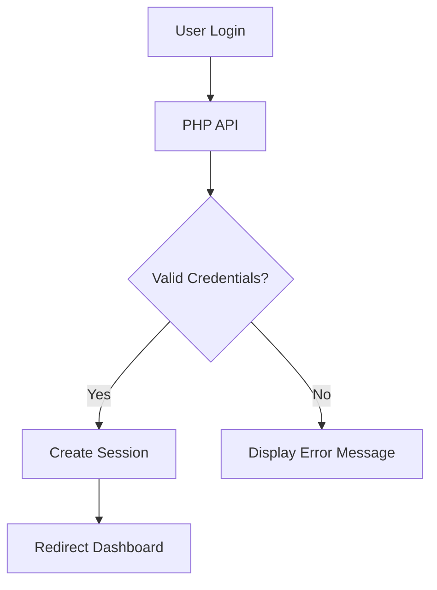

# 🎓 Student Management System
### PHP MVC + REST API + MySQL

A full-stack **Student Management System** built using **PHP MVC Architecture** and **REST API principles**.  
This system manages students, courses, enrollments, attendance, grades, and authentication.

🔗 Repository: https://github.com/LwinKo-kun/SMS-MVC.git

---

# 📸 Project Overview

## 🧩 System Flowchart



---

# 🏗️ MVC Architecture



---

# 🗄️ Database ER Diagram



---

# 🚀 Features

## 🔐 Authentication System
- Admin & Teacher Login
- Session-Based Authentication
- Role Management
- Secure API Validation

---

## 👨‍🎓 Student Management
- Add Students
- Update Student Information
- Delete Students
- View Student Profiles

---

## 📚 Course Management
- Create Courses
- Manage Credits
- Course Descriptions
- Unique Course Codes

---

## 📝 Enrollment Management
- Assign Students to Courses
- Track Enrollment Dates
- Manage Student-Course Relationships

---

## 📊 Grades System
- Store Grades Per Course
- Academic Performance Tracking
- Student Grade Records

---

## 📅 Attendance System
- Present / Absent / Late Status
- Attendance Tracking
- Course-Based Attendance Records

---

# 🧱 Technology Stack

| Layer | Technology |
|------|-------------|
| Frontend | HTML, CSS, JavaScript |
| Backend | PHP |
| Architecture | MVC |
| Database | MySQL / MariaDB |
| API | REST API |
| Server | Apache (XAMPP) |

---

# 📂 Project Structure

```bash
student-MVC/
│
├── app/
│   ├── controllers/
│   ├── models/
│   └── views/
│
├── api/
│
├── config/
│
├── database/
│
├── public/
│   ├── assets/
│   ├── login.html
│   └── dashboard.html
│
└── README.md
```

---

# 📡 API Endpoints

| Endpoint | Method | Description |
|----------|--------|-------------|
| `/api/auth.php` | POST | Login User |
| `/api/session.php` | GET | Check Session |
| `/api/students.php` | GET/POST | Manage Students |
| `/api/courses.php` | GET/POST | Manage Courses |
| `/api/enrollments.php` | GET/POST | Manage Enrollments |
| `/api/grades.php` | GET/POST | Manage Grades |
| `/api/attendance.php` | GET/POST | Manage Attendance |

---

# ⚙️ System Workflow



---

# 🔐 Authentication Workflow



---

# 💻 Installation Guide

## 📌 Requirements
- PHP 8+
- MySQL / MariaDB
- XAMPP
- Modern Browser

---

## ⚡ Setup Instructions

### 1️⃣ Clone Repository

```bash
git clone https://github.com/LwinKo-kun/SMS-MVC.git
```

---

### 2️⃣ Move Project

Place inside:

```bash
C:/xampp/htdocs/
```

---

### 3️⃣ Create Database

Open phpMyAdmin and create:

```sql
student_management
```

---

### 4️⃣ Import SQL File

Import the SQL file from:

```bash
/database
```

---

### 5️⃣ Start XAMPP

Start:
- Apache
- MySQL

---

### 6️⃣ Run Project

```bash
http://localhost/student-MVC/public/login.html
```

---

# 🧠 How The System Works

1. User logs into the system
2. Frontend sends Fetch API request
3. PHP API processes request
4. Controller handles business logic
5. Model interacts with MySQL database
6. JSON response returns to frontend
7. UI updates dynamically

---

# 🔥 Future Improvements

- Replace MD5 with `password_hash()`
- Add JWT Authentication
- React Frontend
- Dashboard Analytics
- Export PDF/Excel Reports
- Pagination & Filtering
- Responsive Mobile UI
- Advanced Role Permissions

---

# 🎯 Learning Objectives

This project demonstrates:

- MVC Architecture
- REST API Development
- CRUD Operations
- Session Authentication
- Database Relationships
- Frontend & Backend Integration
- MySQL Query Design

---

# 👨‍💻 Author

### Lwin Ko Ko Aung
Computer Science Student

Educational project for learning full-stack development with PHP MVC and REST APIs.

---

# 📜 License

This project is developed for educational purposes only.

Repository: https://github.com/LwinKo-kun/SMS-MVC.git
