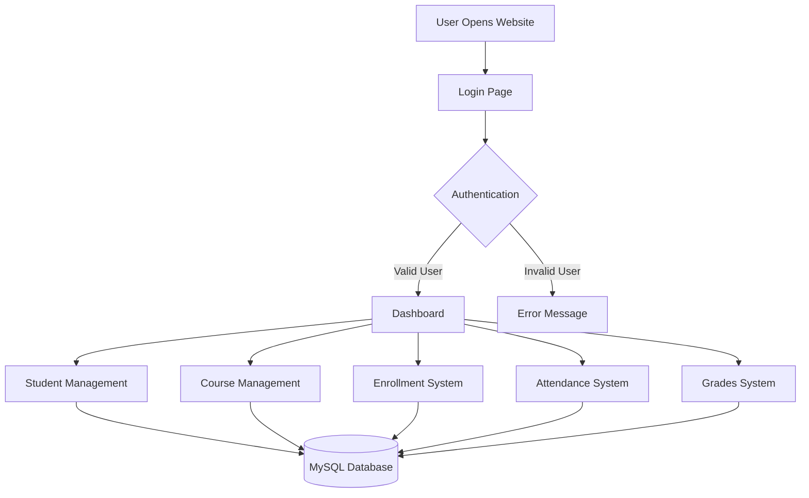
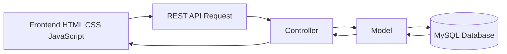
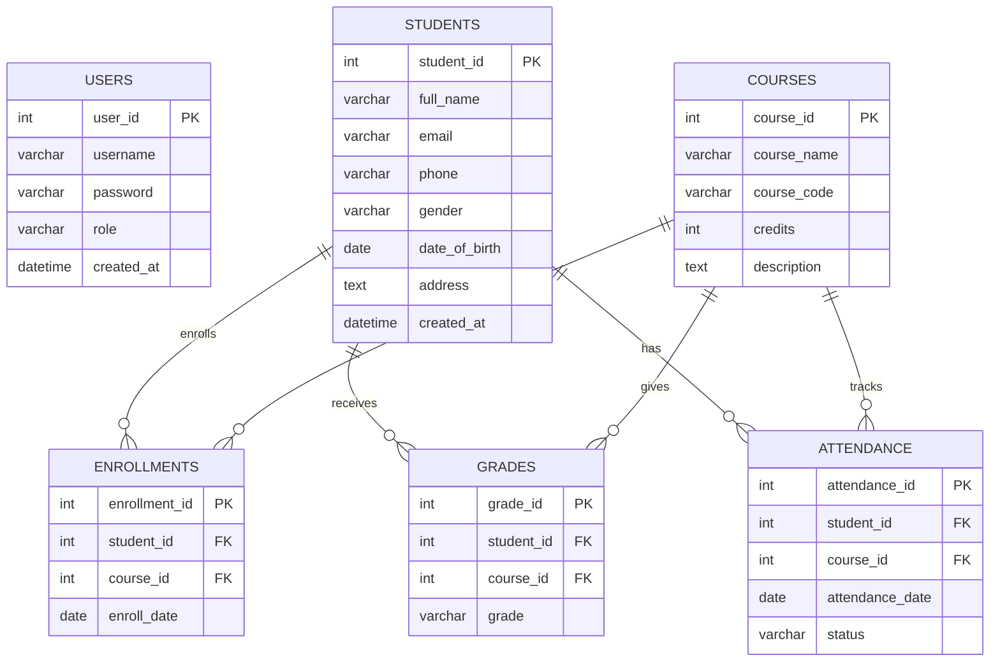
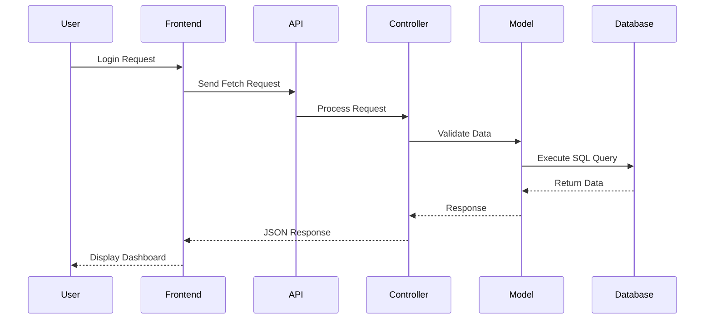
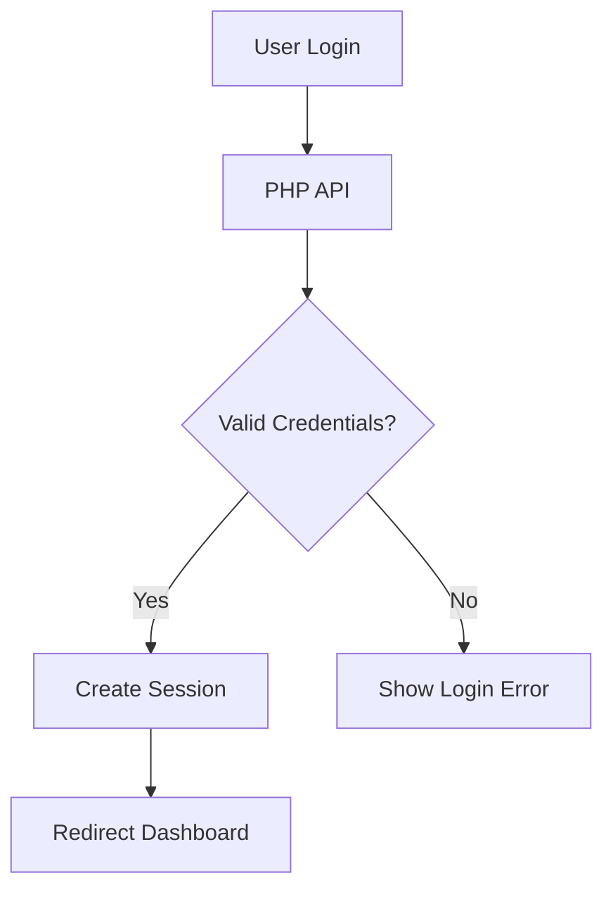

# 🎓 Student Management System
### MVC Architecture + REST API + MySQL

A full-stack **Student Management System** built with:

- 🐘 PHP (MVC Architecture)
- 🗄️ MySQL Database
- 🌐 REST API
- ⚡ JavaScript Fetch API
- 🎨 HTML/CSS Frontend

This project manages students, courses, enrollments, grades, attendance, and authentication using a clean MVC structure.

---

# 📸 Project Overview

## 🧩 System Flowchart



---

# 🏗️ MVC Architecture Flow



---

# 🗄️ Database ER Diagram



---

# 🚀 Features

## 🔐 Authentication System
- Admin / Teacher Login
- Session-Based Authentication
- Secure User Validation
- Role Management

---

## 👨‍🎓 Student Management
- Add Students
- Update Student Information
- Delete Students
- View Student Profiles

---

## 📚 Course Management
- Create Courses
- Manage Course Credits
- Unique Course Codes
- Course Descriptions

---

## 📝 Enrollment Management
- Assign Students to Courses
- Track Enrollment Dates
- Manage Relationships

---

## 📊 Grades System
- Store Student Grades
- Course-Based Grading
- Academic Tracking

---

## 📅 Attendance System
- Mark Attendance
- Present / Absent / Late Status
- Attendance Tracking by Date

---

# 🧱 Technology Stack

| Layer | Technology |
|------|-------------|
| Frontend | HTML, CSS, JavaScript |
| Backend | PHP |
| Architecture | MVC |
| Database | MySQL / MariaDB |
| API | REST API |
| Server | Apache (XAMPP) |

---

# 📂 Project Structure

```bash
student-MVC/
│
├── app/
│   ├── controllers/
│   ├── models/
│   ├── views/
│
├── api/
│
├── config/
│
├── database/
│
├── public/
│   ├── assets/
│   ├── login.html
│   └── dashboard.html
│
└── README.md
```

---

# 📡 API Endpoints

| Endpoint | Method | Description |
|----------|--------|-------------|
| `/api/auth.php` | POST | Login User |
| `/api/session.php` | GET | Check Session |
| `/api/students.php` | GET/POST | Manage Students |
| `/api/courses.php` | GET/POST | Manage Courses |
| `/api/enrollments.php` | GET/POST | Manage Enrollments |
| `/api/grades.php` | GET/POST | Manage Grades |
| `/api/attendance.php` | GET/POST | Manage Attendance |

---

# ⚙️ How The System Works



---

# 🔐 Authentication Workflow



---

# 🛠️ Installation Guide

## 📌 Requirements

- PHP 8+
- MySQL / MariaDB
- XAMPP
- Modern Web Browser

---

## ⚡ Setup Instructions

### 1️⃣ Clone Repository

```bash
git clone https://github.com/your-username/student-MVC.git
```

---

### 2️⃣ Move Project to XAMPP

Place project inside:

```bash
C:/xampp/htdocs/
```

---

### 3️⃣ Create Database

Open phpMyAdmin and create:

```sql
student_management
```

---

### 4️⃣ Import SQL File

Import the SQL file from:

```bash
/database/student_management.sql
```

---

### 5️⃣ Start XAMPP

Start:
- Apache
- MySQL

---

### 6️⃣ Run Project

Open browser:

```bash
http://localhost/student-MVC/public/login.html
```

---

# 🧠 System Workflow

1. User logs in
2. Frontend sends Fetch API request
3. PHP API receives request
4. Controller processes logic
5. Model interacts with database
6. MySQL returns data
7. JSON response sent back
8. Frontend updates UI

---

# 🔥 Future Improvements

- Replace MD5 with `password_hash()`
- JWT Authentication
- React Frontend
- Dashboard Analytics
- PDF/Excel Export
- Search & Filtering
- Role-Based Access Control
- Responsive Mobile UI

---

# 🎯 Learning Objectives

This project demonstrates:

- MVC Architecture
- REST API Development
- CRUD Operations
- Session Authentication
- Database Relationships
- Frontend + Backend Integration
- MySQL Query Design

---

# 👨‍💻 Author

### Lwin Ko Ko Aung
Computer Science Student

Educational MVC + REST API Project for learning full-stack development.

---

# 📜 License

This project is developed for educational purposes only.
