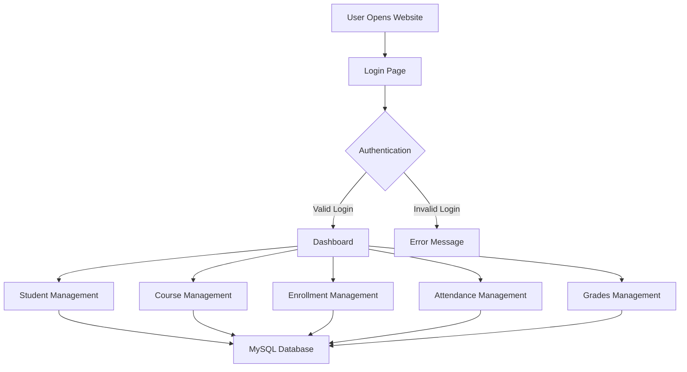
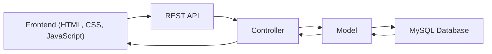
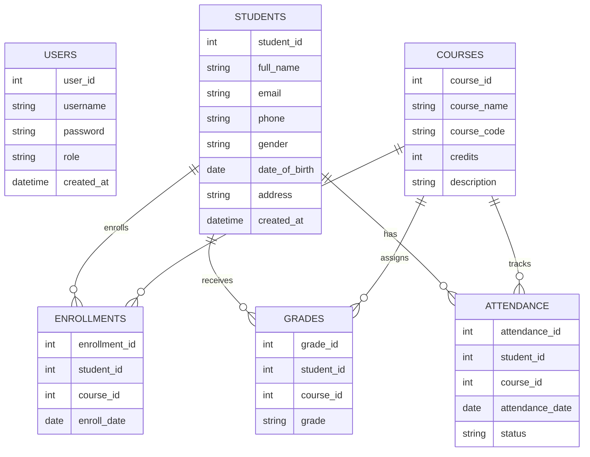
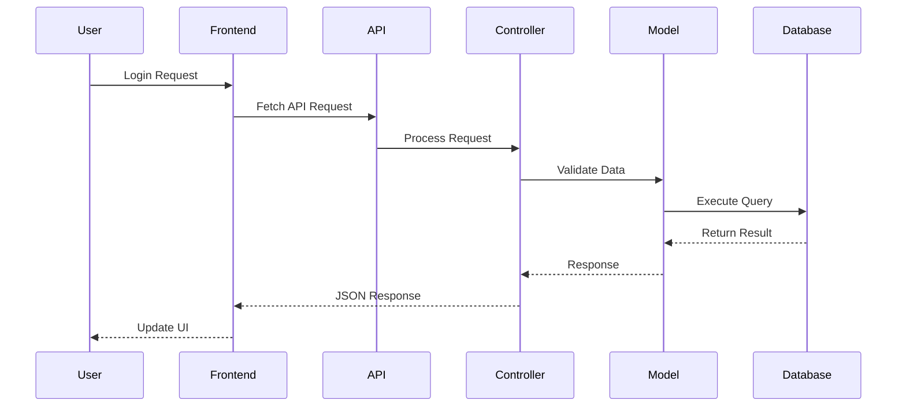
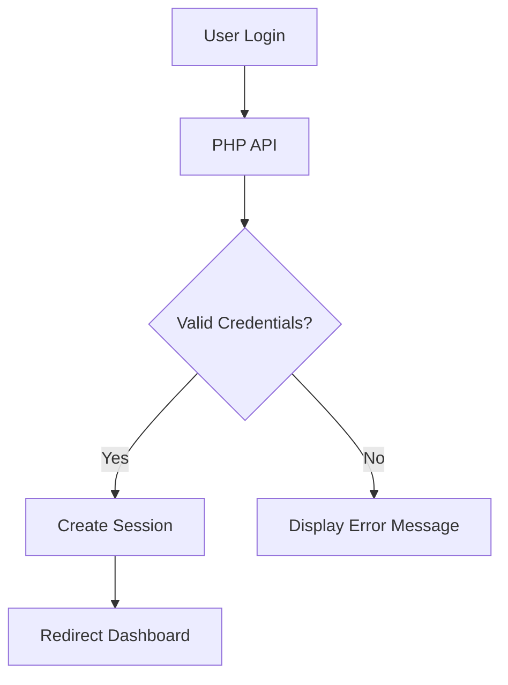

# 🎓 Student Management System

### PHP MVC + REST API + MySQL

A full-stack **Student Management System** built using **PHP MVC Architecture** and **REST API principles**.

This system manages:

* Students
* Courses
* Enrollments
* Attendance
* Grades
* Authentication

🔗 Repository: https://github.com/LwinKo-kun/SMS-MVC

---

# 📸 Project Overview

## 🧩 System Flowchart


```mermaid
flowchart TD

A["User Opens Website"] --> B["Login Page"]

B --> C{"Authentication"}

C -- "Valid Login" --> D["Dashboard"]
C -- "Invalid Login" --> E["Error Message"]

D --> F["Student Management"]
D --> G["Course Management"]
D --> H["Enrollment Management"]
D --> I["Attendance Management"]
D --> J["Grades Management"]

F --> K["MySQL Database"]
G --> K
H --> K
I --> K
J --> K
```

---

# 🏗️ MVC Architecture


```mermaid
flowchart LR

A["Frontend (HTML, CSS, JavaScript)"]
--> B["REST API"]

B --> C["Controller"]

C --> D["Model"]

D --> E["MySQL Database"]

E --> D
D --> C
C --> A
```

---

# 🗄️ Database ER Diagram


```mermaid
erDiagram

USERS {
    int user_id
    string username
    string password
    string role
    datetime created_at
}

STUDENTS {
    int student_id
    string full_name
    string email
    string phone
    string gender
    date date_of_birth
    string address
    datetime created_at
}

COURSES {
    int course_id
    string course_name
    string course_code
    int credits
    string description
}

ENROLLMENTS {
    int enrollment_id
    int student_id
    int course_id
    date enroll_date
}

GRADES {
    int grade_id
    int student_id
    int course_id
    string grade
}

ATTENDANCE {
    int attendance_id
    int student_id
    int course_id
    date attendance_date
    string status
}

STUDENTS ||--o{ ENROLLMENTS : enrolls
COURSES ||--o{ ENROLLMENTS : contains

STUDENTS ||--o{ GRADES : receives
COURSES ||--o{ GRADES : assigns

STUDENTS ||--o{ ATTENDANCE : has
COURSES ||--o{ ATTENDANCE : tracks
```

---

# 🚀 Features

## 🔐 Authentication System

* Admin & Teacher Login
* Session-Based Authentication
* Role Management
* Secure API Validation

## 👨‍🎓 Student Management

* Add Students
* Update Student Information
* Delete Students
* View Student Profiles

## 📚 Course Management

* Create Courses
* Manage Credits
* Course Descriptions
* Unique Course Codes

## 📝 Enrollment Management

* Assign Students to Courses
* Track Enrollment Dates
* Manage Student-Course Relationships

## 📊 Grades System

* Store Grades Per Course
* Academic Performance Tracking
* Student Grade Records

## 📅 Attendance System

* Present / Absent / Late Status
* Attendance Tracking
* Course-Based Attendance Records

---

# 🧱 Technology Stack

| Layer        | Technology            |
| ------------ | --------------------- |
| Frontend     | HTML, CSS, JavaScript |
| Backend      | PHP                   |
| Architecture | MVC                   |
| Database     | MySQL / MariaDB       |
| API          | REST API              |
| Server       | Apache (XAMPP)        |

---

# 📂 Project Structure

```text
SMS-MVC/
│
├── app/
│   ├── controllers/
│   ├── models/
│   └── views/
│
├── api/
│
├── config/
│
├── database/
│
├── public/
│   ├── assets/
│   ├── login.html
│   └── dashboard.html
│
└── README.md
```

---

# 📡 API Endpoints

| Endpoint               | Method     | Description        |
| ---------------------- | ---------- | ------------------ |
| `/api/auth.php`        | POST       | Login User         |
| `/api/session.php`     | GET        | Check Session      |
| `/api/students.php`    | GET / POST | Manage Students    |
| `/api/courses.php`     | GET / POST | Manage Courses     |
| `/api/enrollments.php` | GET / POST | Manage Enrollments |
| `/api/grades.php`      | GET / POST | Manage Grades      |
| `/api/attendance.php`  | GET / POST | Manage Attendance  |

---

# ⚙️ System Workflow


```mermaid
sequenceDiagram

participant User
participant Frontend
participant API
participant Controller
participant Model
participant Database

User->>Frontend: Login Request
Frontend->>API: Fetch API Request
API->>Controller: Process Request
Controller->>Model: Validate Data
Model->>Database: Execute Query
Database-->>Model: Return Result
Model-->>Controller: Response
Controller-->>Frontend: JSON Response
Frontend-->>User: Update UI
```

---

# 🔐 Authentication Workflow


```mermaid
flowchart TD

A["User Login"] --> B["PHP API"]

B --> C{"Valid Credentials?"}

C -- "Yes" --> D["Create Session"]
D --> E["Redirect Dashboard"]

C -- "No" --> F["Display Error Message"]
```

---

# 💻 Installation Guide

## 📌 Requirements

* PHP 8+
* MySQL / MariaDB
* XAMPP
* Modern Browser

---

## ⚡ Setup Instructions

### 1️⃣ Clone Repository

```bash
git clone https://github.com/LwinKo-kun/SMS-MVC.git
```

### 2️⃣ Move Project

Place the project inside:

```text
C:/xampp/htdocs/
```

### 3️⃣ Create Database

Create a database named:

```sql
student_management
```

### 4️⃣ Import SQL File

Import the SQL file located in:

```text
/database
```

### 5️⃣ Start XAMPP

Start:

* Apache
* MySQL

### 6️⃣ Run Project

```text
http://localhost/SMS-MVC/public/login.html
```

---

# 🧠 How The System Works

1. User logs into the system
2. Frontend sends Fetch API requests
3. API receives and processes requests
4. Controller handles business logic
5. Model communicates with database
6. Database returns results
7. JSON response is returned
8. Frontend updates UI dynamically

---

# 🔥 Future Improvements

* Replace MD5 with `password_hash()`
* JWT Authentication
* React Frontend
* Dashboard Analytics
* PDF / Excel Reports
* Pagination & Filtering
* Mobile Responsive UI
* Advanced Role Permissions

---

# 🎯 Learning Objectives

This project demonstrates:

* MVC Architecture
* REST API Development
* CRUD Operations
* Session Authentication
* Database Relationships
* Frontend & Backend Integration
* MySQL Query Design

---

# 👨‍💻 Author

## Lwin Ko Ko Aung

Computer Science Student

Educational project for learning full-stack development using PHP MVC and REST APIs.

---

# 📜 License

This project is developed for educational purposes.

Repository:

https://github.com/LwinKo-kun/SMS-MVC
