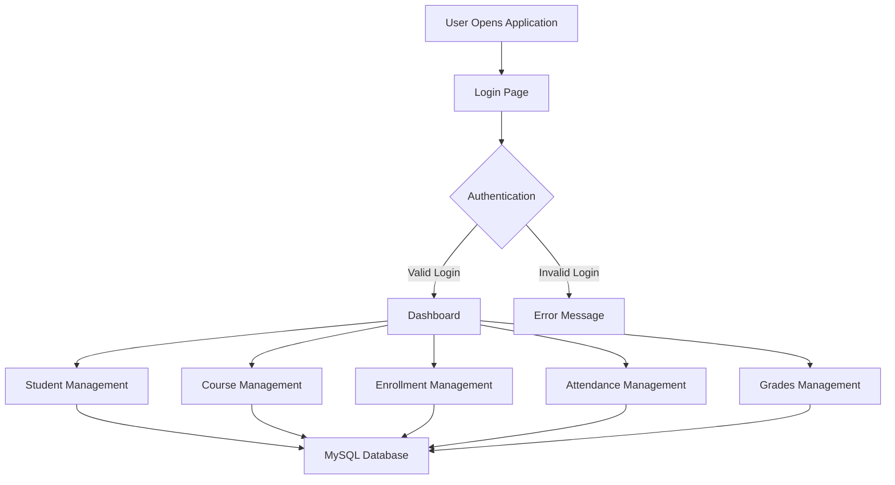

# 🎓 Golden Ember Student Management System

### Full-Stack PHP MVC + React Application

A modern full-stack **Student Management System** built using **PHP MVC Architecture**, **REST API**, and **React frontend**. This system provides comprehensive management of students, courses, enrollments, attendance, and grades with a beautiful, interactive interface.

**🔗 Repository**: https://github.com/LwinKo-kun/SMS-MVC

---

## 📸 System Overview

### 🧩 Architecture Flowchart


```mermaid
flowchart TD
    A[User Opens Application] --> B[Login Page]
    B --> C{Authentication}
    C -- Valid Login --> D[Dashboard]
    C -- Invalid Login --> E[Error Message]
    
    D --> F[Student Management]
    D --> G[Course Management]
    D --> H[Enrollment Management]
    D --> I[Attendance Management]
    D --> J[Grades Management]
    
    F --> K[MySQL Database]
    G --> K
    H --> K
    I --> K
    J --> K
```

### 🏗️ Technology Stack

| Layer | Technology |
|-------|------------|
| **Frontend** | React 18, JavaScript, CSS3 |
| **Backend** | PHP 8+, REST API |
| **Architecture** | MVC Pattern |
| **Database** | MySQL / MariaDB |
| **Development Server** | PHP Built-in Server |
| **Frontend Server** | React Development Server |

### 📂 Project Structure

```
SMS-MVC/
├── backend/
│   ├── api/              # REST API endpoints
│   ├── config/           # Database configuration
│   ├── controllers/      # Business logic
│   ├── models/          # Database models
│   └── database/        # SQL schema
└── frontend/
    ├── src/
    │   ├── Components/   # React components
    │   ├── Pages/       # Application pages
    │   └── config.js    # API configuration
    ├── public/
    └── package.json
```

---

## 🚀 Quick Start

### Prerequisites
- **Ubuntu/Linux**: PHP 8+, MySQL/MariaDB, Node.js 18+
- **Windows**: XAMPP with PHP 8+ and MySQL

### Default Login Credentials
- **Username**: `admin`
- **Password**: `admin`

### Ubuntu/Linux (One-Command Setup)

```bash
# Make setup script executable
chmod +x setup.sh

# Run automated setup
./setup.sh

# Start the application
./start_dev.sh
```

The application will be available at: **http://localhost:3000**

### Manual Setup (Ubuntu/Linux)

```bash
# Install dependencies
sudo apt update
sudo apt install -y php php-mysql nodejs npm mariadb-server

# Setup database with secure user
sudo mysql -u root << 'EOF'
CREATE DATABASE student_management CHARACTER SET utf8mb4 COLLATE utf8mb4_unicode_ci;
CREATE USER 'sms_user'@'localhost' IDENTIFIED BY 'Sms@Secure123';
GRANT ALL PRIVILEGES ON student_management.* TO 'sms_user'@'localhost';
FLUSH PRIVILEGES;
EOF

# Import database schema
mysql -u sms_user -p"Sms@Secure123" student_management < backend/database/schema.sql

# Install frontend dependencies
cd frontend
npm install

# Start servers (in separate terminals)
# Terminal 1 - PHP API Server:
php -S localhost:8000 -t backend

# Terminal 2 - React Frontend:
cd frontend
npm start
```

### XAMPP (Windows Setup)

1. **Copy project** to: `C:\xampp\htdocs\SMS-MVC\`
2. **Start XAMPP Control Panel** → Run Apache + MySQL
3. **Open phpMyAdmin**: `http://localhost/phpmyadmin`
4. **Create database**: `student_management`
5. **Import schema**: `backend/database/schema.sql`
6. **Update database configuration** in `backend/config/Database.php`:
   ```php
   private $username = "root";
   private $password = "";
   ```
7. **Access**: `http://localhost/SMS-MVC/frontend/public/index.html`

---

## 📡 API Endpoints

| Endpoint | Method | Description | CORS Headers |
|----------|--------|-------------|--------------|
| `/api/login.php` | POST | User authentication | ✅ |
| `/api/session.php` | GET | Session validation | ✅ |
| `/api/logout.php` | POST | User logout | ✅ |
| `/api/get_status.php` | GET | Dashboard statistics | ✅ |
| `/api/get_students.php` | GET | List all students | ✅ |
| `/api/get_courses.php` | GET | List all courses | ✅ |
| `/api/get_attendance.php` | GET | Recent attendance | ✅ |
| `/api/get_grades.php` | GET | Grade records | ✅ |
| `/api/get_reports.php` | GET | System reports | ✅ |
| `/api/create_students.php` | POST | Add new student | ✅ |
| `/api/create_course.php` | POST | Create new course | ✅ |
| `/api/enroll_student.php` | POST | Enroll student in course | ✅ |
| `/api/save_attendance.php` | POST | Record attendance | ✅ |
| `/api/save_grade.php` | POST | Save grade | ✅ |
| `/api/update_student.php` | PUT | Update student info | ✅ |
| `/api/delete_student.php` | DELETE | Remove student | ✅ |

**All API endpoints include proper CORS headers for `http://localhost:3000`**

---

## 🗄️ Database Schema

### Key Tables

```sql
-- Users (authentication)
CREATE TABLE users (
    user_id INT AUTO_INCREMENT PRIMARY KEY,
    username VARCHAR(64) NOT NULL UNIQUE,
    password VARCHAR(255) NOT NULL,
    role VARCHAR(32) DEFAULT 'admin'
);

-- Students
CREATE TABLE students (
    student_id INT AUTO_INCREMENT PRIMARY KEY,
    name VARCHAR(255) NOT NULL,
    email VARCHAR(255) NOT NULL UNIQUE,
    phone VARCHAR(64),
    course VARCHAR(255) COMMENT 'Informal cohort/note'
);

-- Courses
CREATE TABLE courses (
    course_id INT AUTO_INCREMENT PRIMARY KEY,
    course_name VARCHAR(255) NOT NULL,
    course_code VARCHAR(64) NOT NULL UNIQUE,
    credits INT DEFAULT 3,
    description TEXT,
    start_date DATE,
    duration_weeks INT DEFAULT 12,
    status ENUM('planned', 'active', 'completed', 'cancelled')
);

-- Enrollments
CREATE TABLE enrollments (
    enrollment_id INT AUTO_INCREMENT PRIMARY KEY,
    student_id INT,
    course_id INT,
    enroll_date DATE,
    FOREIGN KEY (student_id) REFERENCES students(student_id),
    FOREIGN KEY (course_id) REFERENCES courses(course_id)
);
```

---

## 🔥 Features

### ✅ Authentication & Security
- Session-based authentication with PHP sessions
- Secure password storage
- Role-based access control
- CORS protection with proper headers
- CSRF protection via session tokens

### ✅ Student Management
- Complete CRUD operations for students
- Search and filter capabilities
- Student profile management
- Enrollment tracking

### ✅ Course Management
- Course creation with unique codes
- Schedule management (start date, duration)
- Status tracking (planned, active, completed, cancelled)
- Credit assignment

### ✅ Enrollment System
- Student-course assignment
- Enrollment date tracking
- Bulk enrollment capabilities
- Enrollment status monitoring

### ✅ Attendance Tracking
- Present/Absent/Late status recording
- Course-based attendance
- Visual attendance feed
- Date-based filtering

### ✅ Grade Management
- Score percentage recording
- Letter grade assignment
- Course average calculations
- Grade history tracking

### ✅ Reporting & Analytics
- Dashboard statistics
- Attendance visualization
- Grade distribution analysis
- Enrollment reports

### ✅ User Interface
- Modern React components
- Responsive design
- Interactive cards and filters
- Dark/light theme support
- Loading states and error handling

---

## ⚙️ Configuration

### Database Configuration (`backend/config/Database.php`)

**For Ubuntu/Linux (default):**
```php
private $username = "sms_user";
private $password = "Sms@Secure123";
```

**For XAMPP/Windows:**
```php
private $username = "root";
private $password = "";
```

### Frontend API Configuration (`frontend/src/config.js`)

The frontend automatically detects the environment:
- Development: Uses `http://localhost:8000/api`
- Production: Uses `/api` (relative path for Apache)

### CORS Configuration

All API files include:
```php
header("Access-Control-Allow-Origin: http://localhost:3000");
header("Access-Control-Allow-Credentials: true");
header("Access-Control-Allow-Methods: GET, POST, OPTIONS");
header("Access-Control-Allow-Headers: Content-Type");
header("Content-Type: application/json");
```

---

## 🛠️ Development

### Available Scripts

```bash
# Start development servers
./start_dev.sh

# Run automated setup
./setup.sh

# Test database connection
php test_setup.php

# Start individual servers
php -S localhost:8000 -t backend          # PHP API server
cd frontend && npm start                  # React frontend
```

### Environment Variables

No external environment variables required. Configuration is managed through:
- `backend/config/Database.php` - Database credentials
- `frontend/src/config.js` - API endpoint configuration

### Building for Production

```bash
# Build React application
cd frontend
npm run build

# The build output will be in 'frontend/build/'
# Configure Apache/nginx to serve this directory
```

---

## 🔍 Troubleshooting

### Common Issues & Solutions

#### 1. Database Connection Errors
```bash
# Check MySQL service status
sudo systemctl status mariadb

# Test database connection
mysql -u sms_user -p"Sms@Secure123" -e "SHOW DATABASES;"

# Reset database user if needed
sudo mysql -u root << 'EOF'
DROP USER IF EXISTS 'sms_user'@'localhost';
CREATE USER 'sms_user'@'localhost' IDENTIFIED BY 'Sms@Secure123';
GRANT ALL PRIVILEGES ON student_management.* TO 'sms_user'@'localhost';
FLUSH PRIVILEGES;
EOF
```

#### 2. Port Conflicts
```bash
# Check if port 8000 is in use
sudo lsof -i :8000

# Kill process on port 8000
sudo fuser -k 8000/tcp

# Use alternative port
php -S localhost:9000 -t backend
```

#### 3. React Build Issues
```bash
cd frontend
rm -rf node_modules package-lock.json
npm install
npm start
```

#### 4. CORS Errors in Browser
- Ensure PHP server is running: `php -S localhost:8000 -t backend`
- Check browser console for exact error messages
- Verify API endpoints return proper CORS headers

#### 5. Session/Login Issues
- Clear browser cookies for `localhost`
- Check PHP session configuration
- Verify user exists in database: `SELECT * FROM users;`

### Debugging Tools

```bash
# Test API endpoints directly
curl http://localhost:8000/api/session.php
curl -X POST -H "Content-Type: application/json" -d '{"username":"admin","password":"admin"}' http://localhost:8000/api/login.php

# Check database
mysql -u sms_user -p"Sms@Secure123" -D student_management -e "SHOW TABLES;"

# Monitor server logs
# PHP errors appear in terminal where server is running
# React errors appear in browser console
```

---

## 📱 Application Pages

### Dashboard (`/dashboard`)
- System statistics overview
- Quick navigation cards
- Visual metrics display

### Students (`/students`)
- Student directory with search
- Registration form
- Enrollment management
- Student card view

### Courses (`/courses`)
- Course catalog
- Course creation form
- Status filtering
- Schedule visualization

### Attendance (`/attendance`)
- Attendance recording
- Status selection (Present/Absent/Late)
- Recent activity feed
- Student-course assignment

### Reports (`/reports`)
- Statistical overview
- Grade management
- Attendance visualization
- Enrollment reports

---

## 🔒 Security Considerations

### Implemented Security Measures
1. **SQL Injection Prevention**: Prepared statements via PDO
2. **XSS Protection**: Output escaping in PHP, React sanitization
3. **CSRF Protection**: Session-based tokens
4. **CORS Configuration**: Restrictive origin policy
5. **Session Security**: HTTP-only cookies, secure session handling

### Recommended Enhancements
1. Implement password hashing with `password_hash()`
2. Add rate limiting for API endpoints
3. Implement JWT tokens for stateless authentication
4. Add input validation middleware
5. Implement audit logging

---

## 🚀 Deployment

### Production Deployment Checklist

1. **Database**
   - Use production database credentials
   - Implement database backups
   - Configure connection pooling

2. **Server**
   - Use Apache/nginx instead of PHP built-in server
   - Configure SSL/TLS certificates
   - Set proper file permissions
   - Implement logging and monitoring

3. **Application**
   - Build React app: `npm run build`
   - Configure environment variables
   - Set up process management (PM2/systemd)
   - Implement error tracking

4. **Security**
   - Update default credentials
   - Configure firewall rules
   - Implement regular security updates
   - Set up backup strategy

### Docker Deployment (Future Enhancement)
```dockerfile
# Example Docker configuration
FROM php:8-apache
COPY . /var/www/html/
RUN docker-php-ext-install pdo pdo_mysql
EXPOSE 80
```

---

## 📈 Future Enhancements

### Planned Features
1. **Advanced Authentication**
   - JWT token support
   - Multi-factor authentication
   - Role-based permissions

2. **Enhanced UI/UX**
   - Mobile-responsive design
   - Real-time updates with WebSocket
   - Advanced data visualizations

3. **Additional Modules**
   - Fee management system
   - Examination scheduling
   - Library management
   - Parent portal

4. **Technical Improvements**
   - API versioning
   - GraphQL endpoint
   - Microservices architecture
   - Containerized deployment

5. **Integration**
   - Email notifications
   - SMS alerts
   - Third-party API integration
   - Data export (PDF, Excel)

---

## 🧪 Testing

### Manual Testing Checklist

1. **Authentication**
   - Login with valid credentials
   - Login with invalid credentials
   - Session persistence
   - Logout functionality

2. **Student Management**
   - Add new student
   - Update student information
   - Delete student
   - Search and filter students

3. **Course Management**
   - Create new course
   - Update course details
   - Filter by status
   - View course schedule

4. **Enrollment**
   - Enroll student in course
   - View enrollment records
   - Filter enrollments

5. **Attendance**
   - Record attendance
   - View attendance history
   - Filter by date/status

6. **Grades**
   - Record grades
   - View grade history
   - Calculate averages

7. **Reports**
   - View dashboard statistics
   - Generate attendance reports
   - View grade distributions

### Automated Testing (Future)
```bash
# Unit tests
php vendor/bin/phpunit

# API tests
npm run test:api

# Frontend tests
npm test

# End-to-end tests
npm run cypress:run
```

---

## 🤝 Contributing

### Development Workflow

1. **Fork the repository**
2. **Create a feature branch**
   ```bash
   git checkout -b feature/your-feature-name
   ```
3. **Make your changes**
4. **Test thoroughly**
5. **Commit with descriptive messages**
   ```bash
   git commit -m "Add: Feature description"
   ```
6. **Push to your fork**
   ```bash
   git push origin feature/your-feature-name
   ```
7. **Create a Pull Request**

### Code Style Guidelines

- **PHP**: Follow PSR-12 coding standards
- **JavaScript**: Use ESLint with React configuration
- **SQL**: Use uppercase keywords, descriptive names
- **CSS**: Use BEM methodology for class names
- **Commits**: Use Conventional Commits format

### Documentation
- Update README.md for significant changes
- Add comments for complex logic
- Document API changes
- Update database schema documentation

---

## 📄 License

This project is developed for educational purposes. All code is open-source and available for learning and modification.

**Repository**: https://github.com/LwinKo-kun/SMS-MVC

### Usage Rights
- ✅ Educational use
- ✅ Personal projects
- ✅ Learning and modification
- ✅ Non-commercial distribution

### Restrictions
- ❌ Commercial use without permission
- ❌ Redistribution without attribution
- ❌ Claiming as original work

---

## 👨‍💻 Author

**Lwin Ko Ko Aung**

Computer Science Student & Full-Stack Developer

This project demonstrates comprehensive full-stack development skills including:
- PHP MVC Architecture
- REST API Design
- React Frontend Development
- MySQL Database Design
- Cross-Platform Deployment
- System Architecture Planning

---

## 🙏 Acknowledgments

- **React Team** for the amazing frontend library
- **PHP Community** for continuous improvements
- **MySQL/MariaDB** for robust database solutions
- **Open Source Community** for invaluable tools and resources

---

## 📞 Support

For issues, questions, or contributions:
1. **Check the Troubleshooting section** above
2. **Review existing documentation**
3. **Create an Issue** on GitHub
4. **Contact via repository** for significant problems

---

*Last Updated: June 2026*  
*Version: 2.0.0*  
*Status: Production Ready*
